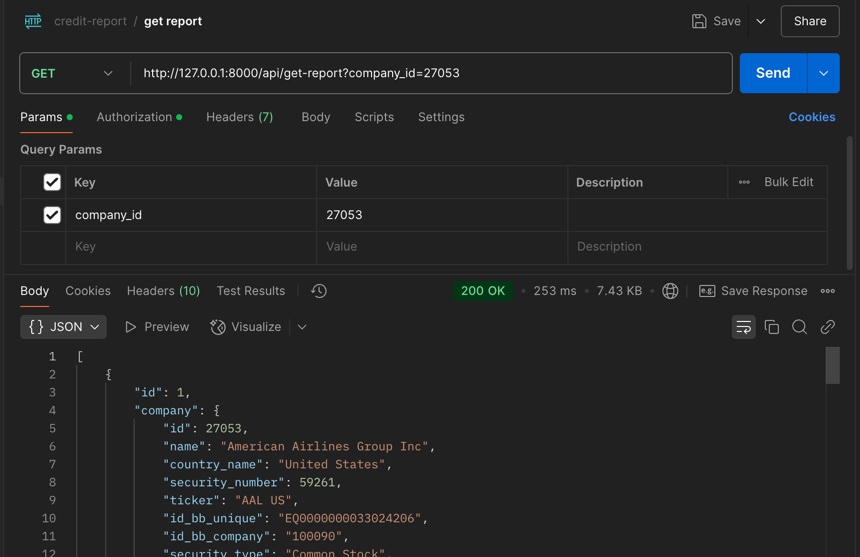
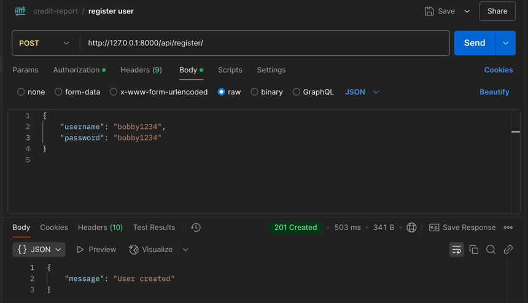
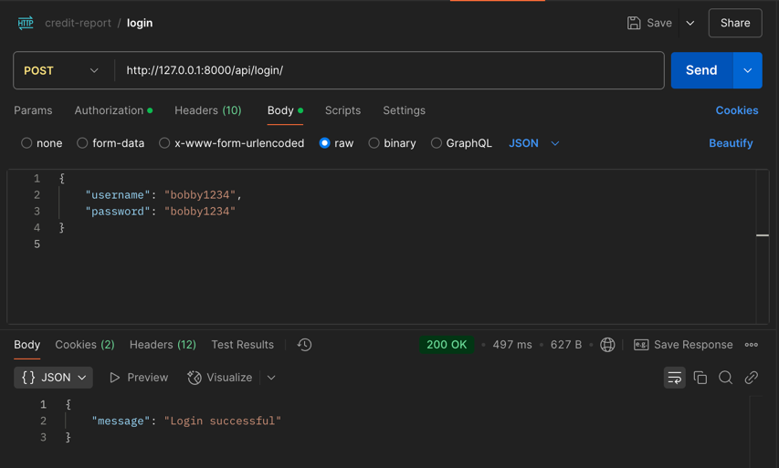
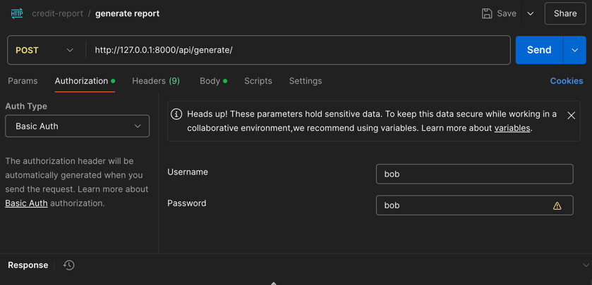

# Credit Report Generator API

This is a Django-based web application that allows users to generate credit rating reports for companies using an LLM (Llama 3.3 70B) and retrieve previously generated reports. The app uses SQLite 3 and MongoDB for data storage and requires basic authentication for accessing report-related endpoints.

~~It is hosted on an AWS EC2 instance. The public IPv4 address is `13.238.253.223`.~~ **This app is no longer hosted on AWS.**

## Table of Contents
1. [Project Overview](#project-overview)
2. [Features](#features)
3. [Tech Stack](#tech-stack)
4. [Setup Instructions](#setup-instructions)
5. [Usage](#usage)
6. [Authentication](#authentication)
7. [Database](#database)
8. [Dummy Report](#dummy-report)
9. [LLM Usage](#llm-usage)

## Project Overview

This project allows users to:
1. Create a new user account.
2. Log in to the system using their credentials.
3. Generate credit rating reports for companies stored in the database, either by `company_id` or `company_name`. The report generation is done using the existing data on companies which is passed to the Llama 3.3 70B model.
4. Retrieve previously generated reports, filtered by date range and whether reports were created by the logged-in user or all users.

The web app is currently hosted on an AWS EC2 instance, but the setup instructions below are for **local usage**. You can run the app locally to test its functionality or deploy it on your own cloud infrastructure if desired.

## Features

- User registration and login.
- Basic authentication for report generation and retrieval.
- API for generating credit reports using LLM (simulated or dummy reports for this task).
- API for retrieving reports, with optional filters for date range and user-specific reports.
- SQLite3 to store user and report data, MongoDB for storing additional company-related data such as earnings call transcripts and Ten-K annual reports.

## Tech Stack

- **Backend**: Django 5.1.1, Django Rest Framework
- **Database**: SQLite3 (Django ORM), MongoDB (via `pymongo`)
- **Authentication**: Basic Authentication
- **Others**: Python 3.12.7, Postman (for testing)
- **Hosting**: AWS EC2 (public IP: `13.238.253.223`)

## Setup Instructions

These instructions are for local usage.

### Django

### 1. Clone the Repository
`git clone https://github.com/your-username/credit-report-generator.git`
`cd credit-report-generator`

### 2. Ensure python version is 3.12 first.
### 3. Set up a virtual environment.
    
`python -m venv venv`
`source venv/bin/activate   # On Windows: venv\Scripts\activate`

### 4. Install requirements
`pip install -r requirements.txt`

### 5. Create a superuser
This will be the admin user.
Run the command `python manage.py createsuperuser`
Only username and password is required

### 6. Start the Django Development Server
Ensure the current working directory is credit-report-generator/
Run `python manage.py runserver`

### 7. Admin interface can be accessed via `http://127.0.0.1:8000/admin/login/?next=/admin/`
Use your superuser credentials to login.

### Setup a local MongoDB connection
Please install MongoDB, MongoDB Command Line Database Tools and MongoDB Compass if you do not have it.

1. [MongoDB Installation Guide](https://www.mongodb.com/docs/manual/installation/)
2. [MongoDB Command Line Databse Tools](https://www.mongodb.com/try/download/database-tools)
3. [MongoDB Compass](https://www.mongodb.com/try/download/compass)
4. Open MongoDB Compass and start a new connection on mongodb://localhost:27017
5. Run the command `mongorestore --db company_data path/to/dump/` where `path/to/dump` is the path to the `company_data` folder in `datadump` in the repository. If you are in `credit-report-generator/` then the command would be `mongorestore --db company_data datadump/company_data`
6. Check MongoDB Compass to verify the data dump was sucessful.


## Usage

Please look at the [Swagger document](openapi.yaml) for full details.

### Generating a report

Local URL: http://127.0.0.1:8000/api/generate/
AWS EC2: http://13.238.253.223:8000/api/generate/

This API generates report based on company ID or company name.

ID is the same company ID as in `company_metadata.json`. e.g. `42601` for `Amazon.com Inc`.

There is also the option to use the LLM or not. If not used, the API simply returns a dummy report stored locally.

Example usage locally:

Curl: 
```curl --location 'http://127.0.0.1:8000/api/generate/' \
--header 'Content-Type: application/json' \
--header 'Authorization: Basic Ym9iOmJvYg==' \
--data '{
    "company_id": 27053,
    "use_llm": true
}'
```


If the request cannot be authorized, please try adding basic auth on Postman. `bob` is the admin user.


When using the LLM, this API uses the companies financial ratios as a parameter. Unfortunately, using the earning calls transcripts and the Ten K reports exceeded the maximum allowed tokens for the free usage of the Llama 3.3 70B model.

### Getting a report

Local URL: http://127.0.0.1:8000/api/get-report
AWS EC2: ~~http://13.238.253.223:8000/api/get-report~~

This API allows the user to retrieve previously generated reports.

- The user can specify for which company they would like the reports for. Either by company name or company ID.
- Reports can be filtered by date created
- The user can specify for their own reports or reports created by any user

Example usage:



Curl: 
```
curl --location 'http://127.0.0.1:8000/api/get-report?company_id=27053' \
--header 'Authorization: Basic Ym9iOmJvYg=='
```

If the request cannot be authorized, please try adding basic auth on Postman. `bob` is the admin user.

### Registering a new user

Local URL: http://127.0.0.1:8000/api/register
~~AWS EC2: http://13.238.253.223:8000/api/register~~

~~The EC2 instance requires basic authentication to be enabled on Postman when creating a new user, but the local copy works as expected.~~
Example local usage:



Curl: 
```
curl --location 'http://127.0.0.1:8000/api/register/' \
--header 'Content-Type: application/json' \
--header 'Authorization: Basic Ym9iOmJvYg==' \
--data '{
    "username": "bobby1234",
    "password": "bobby1234"
}
'
```

### Logging in

Please enter the username and password in both the request body and via `Basic Auth` on Postman.

Example usage: 



Curl: 
```
curl --location 'http://127.0.0.1:8000/api/login/' \
--header 'Content-Type: application/json' \
--header 'Authorization: Basic Ym9iOmJvYg==' \
--header 'Cookie: csrftoken=9JiLveqgKqLtc9af4n2yHCSdnulxYpH9; sessionid=0fbzey619mumr6guyuti71uxqbnq3c13' \
--data '{
    "username": "bobby1234",
    "password": "bobby1234"
}
'
```

## Authentication

The report generation and retrieval APIs require Basic Authentication first.

On Postman, please enter the user credentials in `Authorization > Basic Auth`



## Database

MongoDB is used to store the more flexible data like the transcripts and reports. 

While this data is not used in the LLM report generation (due to insufficient tokens) they are still queried and stored in memory, to show that the application is indeed compatible with both a Relational and Non-relational database.

## Dummy Report

The dummy report is simply an article from Fitch.

## LLM Usage

This API uses the ~~Llama 3.1 70B model~~ (now deprecated) Llama 3.3 70B - provided by [Groq](https://console.groq.com/docs/quickstart).

Due to insufficient tokens, we only feed the LLM the financial ratios of each company. In the code, the ECC transcripts and 
10-K reports are queried, but not passed into the LLM.

